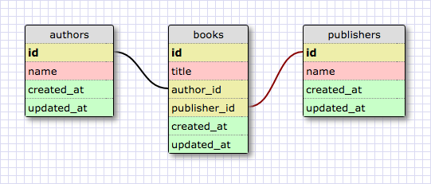

# Part 4: SQL Queries

## Summary

In this part of the assessment you'll be working with the provided `bookshelf.sqlite` database to demonstrate your ability to work with data in a relational database. The schema is made up of three tables: `books`, `authors`, and `publishers` (see Figure 1).

  
*Figure 1.* Database schema visualization

To get started, navigate to the `part-4` directory in the terminal.  Then, open a SQLITE session with the following command

```bash
$ sqlite3 bookshelf.sqlite
```

## Releases

### Release 0: Query the Database
For each question below, write a single SQL query that will answer the question.  The query should return only the data that is requested.

Copy each query and its output to the `part-4/queries.md` file.

1.  What are all the book titles?
2.  Which book titles include the word "Ruby"?
3.  What are the titles of the books written by Jonathan Penn?
4.  What are the names of the publishers who've published books with "iOS" in the title? (Each name should be listed once; no repeats.)
5.  What are the names of the publishers who have published the author Russ Olsen? (Each name should be listed once; no repeats.)
6.  What is the name of the publisher who's published the most books, and how many books has it published?


### Release 1: Modify the Database
In each item below, you'll be asked to update the database in someway.  You may run multiple statements to make an update.  Record any SQL statements that you write to make the updates in the `part-4/queries.md` file.

1.  O'Reilly, one of the publishers in the database, published a book titled "Apprenticeship Patterns".  It was written by Dave Hoover.  Update the database to reflect this.

2.  There's an author named Obie Fernandez in the database.  The name should be "Obed (Obie) Fernandez".  Update the database to reflect this.

3.  You don't need to store data on books published by Wiley.  Remove this publisher and their books from the database.


## Conclusion

You are done with part-4. If you have not committed your changes, please do so before moving onto part-5.
